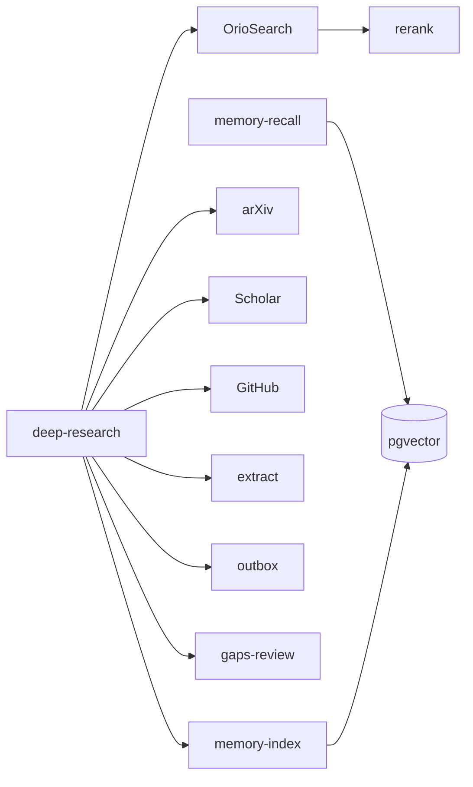

# Sovereign Research

**Self-hosted web search and extraction for AI agents** — Tavily SaaS replaced, multi-retriever recall, owned reranking, compounding pgvector memory, and **Goodresearch-style harness discipline** (write it down, read full text, stare at gaps).

Runs [OrioSearch](https://github.com/vkfolio/orio-search) on your VPS. Built for [Hermes Agent](https://github.com/NousResearch/hermes-agent); works with any shell-based agent loop.

**Full architecture + Goodresearch mapping:** [docs/Goodresearch.md](docs/Goodresearch.md)

---

## Status: end-to-end (phases 1–4c)

| Phase | What | Status |
|-------|------|--------|
| **1** | OrioSearch sidecar (SearXNG + extract + cache) | ✅ |
| **2** | Hermes `web_search` / `web_extract` → local API | ✅ |
| **2b** | Harness: `web-search`, `deep-research` | ✅ |
| **3** | Remember: pgvector on **your** Supabase | ✅ |
| **4** | Rank: FlashRank reranker | ✅ |
| **4b** | Multi-retriever: arXiv, Scholar, GitHub | ✅ |
| **4c** | Gaps review before synthesis | ✅ |
| **4d** | READ cascade (trafilatura → Playwright) | ✅ |
| **4e** | `research-gate` code judge (no reply without harness) | ✅ |
| **5** | X API, RSS freshness | Later |

**Embeddings:** OpenAI direct (`OPENAI_API_KEY` on research agent only). Chat/reasoning stays on free OpenRouter models.

---

## Recall → Read → Rank → Remember



| Stage | Job | Implementation |
|-------|-----|------------------|
| **Recall** | Find what exists | OrioSearch + arXiv + Scholar + GitHub + prior pgvector memory |
| **Read** | Full text, not snippets | `extract_cascade` (trafilatura → Playwright); Orio `/search` only |
| **Rank** | Signal first | FlashRank in OrioSearch |
| **Remember** | Never start from zero | `memory-index` / `memory-recall` on your Supabase |

---

## Goodresearch — what we coded from the article

Popular “how to actually research” advice (tighten the loop, write everything down, read primary sources, stare at failures). We **operationalize** the parts that belong in code:

| Principle | In this repo |
|-----------|--------------|
| Tighten the loop | One-command `deep-research`; no 20-turn web tool chains |
| Write everything down | `outbox/<slug>/report.md`, `sources.json`, `gaps.json`, `queries.txt` |
| Read the appendix | Extract `full_text`; SOUL bans snippet-only synthesis |
| Stare at outputs | `gaps-review` before Telegram reply |
| Diversify inputs | Four retrievers merged per run |
| Shannon method | `web-search` (small) vs `deep-research` (full) |
| Own Rank + Remember | Local rerank + your pgvector — no Tavily rent |

**Left to humans:** pick your own problem (Hamming), Schulman Mode B goal choice, taste training via prediction logs.

---

## Quick start

```bash
git clone https://github.com/DeEnabler/sovereign-research.git
cd sovereign-research
cp .env.example .env

./scripts/install-orio.sh
./scripts/smoke.sh
```

```bash
export PATH="$PWD/bin:$PATH"
web-search "best open source AI agent frameworks" --max 5
deep-research "sovereign AI agent search" --depth quick
cat workspace/outbox/*/gaps.json | head -40
```

---

## Memory (Phase 3)

**Your** Supabase only — never a client/tenant DB.

```bash
# 1. Run scripts/research-memory/schema.sql in your Supabase SQL editor
# 2. .env
RESEARCH_SUPABASE_URL=https://YOUR_PROJECT.supabase.co
RESEARCH_SUPABASE_SERVICE_ROLE_KEY=your-service-role-key
OPENAI_API_KEY=sk-...          # embeddings (research agent only)
OPENROUTER_API_KEY=sk-or-...   # free chat via Headroom

# 3. Automatic in deep-research; verify before reply:
deep-research "topic" --depth quick
research-gate "topic"
embed-key-status
```

---

## Plug into Tavily clients

```bash
export TAVILY_BASE_URL=http://127.0.0.1:8000
export TAVILY_API_KEY=local
```

### Hermes Agent

1. `./scripts/install-orio.sh`
2. Copy `hermes/` into agent config
3. `hermes/.env`: `TAVILY_BASE_URL=http://orio-search-api:8000`, `OPENAI_API_KEY` for memory
4. `config.yaml`: `web.search_backend: tavily` — **do not** disable `browser` toolset (drops `web_search`)
5. Mount `bin/` on PATH

---

## Repo layout

| Path | Purpose |
|------|---------|
| `oriosearch/` | Docker overlay + rerank config |
| `bin/deep-research` | Full loop: recall → multi-search → extract → outbox → gaps → index |
| `bin/gaps-review` | Failure/coverage checklist |
| `bin/memory-*` | pgvector recall/index/reembed |
| `scripts/research-memory/embed_client.py` | OpenAI-first embeddings |
| `hermes/SOUL.md` | Harness-first + Goodresearch rules |

---

## Skipped (v1)

OmniSearch, Harness-1, Firecrawl self-host, knowledge graphs, Exa replacement, web on shipping bots.

---

## Credits

- [OrioSearch](https://github.com/vkfolio/orio-search) + [SearXNG](https://github.com/searxng/searxng)
- Recall/Read/Rank/Remember — modular retrieval architecture
- Goodresearch discipline — harness, outbox, gaps (article/rulebook vibes encoded where they belong)

MIT — [LICENSE](LICENSE)
