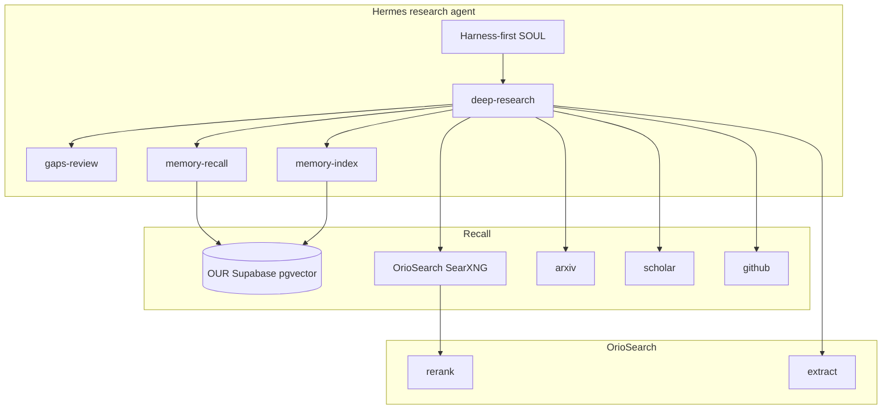

# Sovereign Research

**Self-hosted web search and extraction for AI agents** — a drop-in replacement for Tavily SaaS, with multi-retriever recall, reranking, and compounding pgvector memory.

Runs [OrioSearch](https://github.com/vkfolio/orio-search) (SearXNG + Redis + Tavily-compatible API) on your own VPS. Point any agent framework that speaks the Tavily API at your instance — no paid search subscription for the Recall + Read + Rank path.

Built for [Hermes Agent](https://github.com/NousResearch/hermes-agent); harness scripts work with any shell-based agent loop.

## Phased roadmap (what we actually built)

| Phase | Name | Status | What it does |
|-------|------|--------|--------------|
| **1** | Sovereign sidecar | **Done** | OrioSearch on VPS — SearXNG `/search` + `/extract`, Tavily-compatible API |
| **2** | Hermes native web | **Done** | `web_search` + `web_extract` → local OrioSearch (not api.tavily.com) |
| **2b** | Harness scripts | **Done** | `web-search`, `deep-research` — deterministic, quota-friendly |
| **3** | Remember | **Done** | pgvector on **your** Supabase — `memory-recall` before search, `memory-index` after report |
| **4** | Rank | **Done** | FlashRank reranker (`ms-marco-MiniLM-L-12-v2`) in OrioSearch |
| **4b** | Multi-retriever | **Done** | arXiv + Semantic Scholar + GitHub merged into `deep-research` |
| **4c** | Gaps review | **Done** | `gaps-review` + harness-first SOUL — stare at failures before synthesizing |
| **5** | Freshness + X | **Later** | News/RSS harness; `x_search` when X API key added |
| — | Skip for v1 | — | OmniSearch, Harness-1, Firecrawl self-host, knowledge graphs, GPU local-deep-research |

### Architecture (Recall → Read → Rank → Remember)



## Why this exists

Default agent research (Tavily, Exa, built-in browsing) is SaaS — quota caps, vendor lock-in, queries on someone else's infra. This stack gives you:

- **Local `/search`** via SearXNG (aggregated web)
- **Local `/extract`** (page content for synthesis)
- **Tavily-compatible API** — `TAVILY_BASE_URL` points at OrioSearch
- **Specialist retrievers** — arXiv, Semantic Scholar, GitHub (no Exa bill)
- **Rerank** — ms-marco cross-encoder in OrioSearch
- **Compounding memory** — pgvector on **your** Supabase (not a client project)
- **Harness discipline** — `deep-research` → `gaps-review` → cited Telegram reply

**Replaces Tavily** for search+extract. **Does not replace Exa** (semantic/neural search is a different API).

## Quick start

```bash
git clone https://github.com/DeEnabler/sovereign-research.git
cd sovereign-research
cp .env.example .env

./scripts/install-orio.sh
./scripts/smoke.sh
```

```bash
export PATH="$PWD/bin:$PATH"
web-search "best open source AI agent frameworks" --max 5
deep-research "sovereign AI agent search" --depth quick
ls -lt workspace/outbox/   # report.md, sources.json, gaps.json
```

## Phase 3 — pgvector memory (OUR Supabase only)

Research memory uses **your** Supabase project — **not** a client/tenant DB.

```bash
# 1. Run schema once (Supabase Dashboard → SQL Editor)
#    scripts/research-memory/schema.sql
#    Project: yours (e.g. srjtsuqhcusvtgegwcpo) — NOT client recipients/send_logs DB

# 2. Set in .env
RESEARCH_SUPABASE_URL=https://YOUR_PROJECT.supabase.co
RESEARCH_SUPABASE_SERVICE_ROLE_KEY=your-service-role-key
OPENROUTER_API_KEY=your-key   # for embeddings

# 3. Automatic in deep-research
memory-recall "topic"    # before web search
memory-index             # after report written
```

## Plug into Tavily clients

```bash
export TAVILY_BASE_URL=http://127.0.0.1:8000
export TAVILY_API_KEY=local
```

### Hermes Agent

1. `./scripts/install-orio.sh`
2. Copy `hermes/` into agent config dir
3. `hermes/.env`: `TAVILY_BASE_URL=http://orio-search-api:8000`, `TAVILY_API_KEY=local`
4. `config.yaml`: `web.search_backend: tavily`, `web.extract_backend: tavily`
5. **Do not** add `browser` to `disabled_toolsets` (drops `web_search`)
6. Mount `bin/` on PATH (`/usr/local/agent-bin`)

## What's in the repo

| Path | Purpose |
|------|---------|
| `oriosearch/` | Docker overlay + config (rerank on, 768m RAM) |
| `bin/web-search` | One-shot OrioSearch search |
| `bin/deep-research` | Multi-retriever + extract + outbox + gaps + memory |
| `bin/arxiv-search`, `scholar-search`, `github-search` | Specialist retrievers |
| `bin/gaps-review` | Post-run synthesis checklist |
| `bin/memory-recall`, `memory-index` | OUR Supabase pgvector |
| `scripts/research-memory/schema.sql` | One-time pgvector schema |
| `hermes/` | SOUL, config, skills |

## Configuration

`oriosearch/config.yaml`:

- SearXNG backend (no Google API keys)
- Auth off (`TAVILY_API_KEY=local`)
- Rerank on; API 768m RAM, 1 gunicorn worker
- Redis cache on

Optional env: `S2_API_KEY`, `GITHUB_TOKEN` for higher API rate limits.

## What we explicitly skip (v1)

- OmniSearch full stack (Celery/MCTS/Playwright ops burden)
- Harness-1 / GPU retrieval subagents
- Firecrawl self-host
- Knowledge graphs
- Enabling web on shipping/code bots (research agent only)

## Credits

- [OrioSearch](https://github.com/vkfolio/orio-search) — Tavily-shaped API + SearXNG
- [SearXNG](https://github.com/searxng/searxng) — metasearch
- Goodresearch harness discipline — write it down, stare at gaps, diversify inputs

## License

MIT — see [LICENSE](LICENSE).
