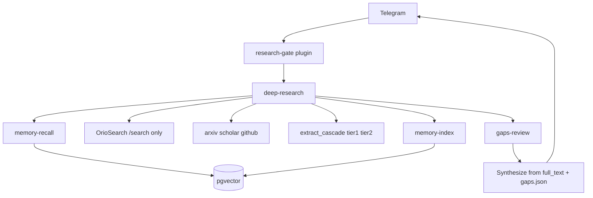

# Sovereign Research — how it works (Goodresearch vibes)

Operational map for the VPS research stack. Public mirror: [sovereign-research](https://github.com/DeEnabler/sovereign-research).

---

## Debug appendix (2026-06-26 VPS audit)

### Bad Telegram reply — root cause

| Session | Problem |
|---------|---------|
| **Origami reverse-engineering** (Jun 26) | Bot skipped `deep-research`; wrote ad-hoc `sources.json` (bare URL list); used `execute_code`, `write_file`, cloned repos — **not research harness** |
| **Early agent-frameworks query** (Jun 14) | Skipped harness; 9× native `web_extract` on guessed URLs; no `gaps.json`; listicle answer from training data |

**Fix:** `research-gate` plugin (code judge) + extract cascade — not SOUL prose alone.

### Harness runs (when it works)

| Run | Sources | full_text ≥200 | snippet-only |
|-----|---------|----------------|--------------|
| `ai-agent-frameworks-smoke` | 18 | 6 | 12 |
| `cold-b2b-outreach` (Jun 25) | 20 | 12 | 8 |

Orio-only extract left ~40–60% snippet-only → **trafilatura → Playwright cascade** added.

---

## Architecture: Recall → Read → Rank → Remember



---

## READ cascade (per URL)

```text
URL from search
  → fetch HTML + trafilatura          (tier 1)
  → if thin: Playwright + trafilatura (tier 2)
  → else: snippet-only in gaps.json    (failed)
```

Logged in `sources.json`: `extract_tier`, `extract_method`.

OrioSearch `/extract` optional fallback: `EXTRACT_USE_ORIO=1` (default off).

---

## research-gate (before Telegram reply)

```bash
deep-research "topic" --depth quick
research-gate "topic"   # must PASS
cat outbox/.../gaps.json
```

Checks: harness dir `YYYYMMDD-HHMMSS-*`, `sources.json`, `gaps.json`, `report.md`, ≥3 full_text sources, `.gate-ok` stamp.

Hermes plugin auto-continues until gate passes (like `completion-gate` for makers).

---

## Goodresearch → code

| Principle | Implementation |
|-----------|------------------|
| Tighten the loop | `deep-research` one command; `research-gate` enforces |
| Write everything down | `outbox/<slug>/` artifacts every run |
| Read the appendix | extract cascade → `full_text`; SOUL bans snippet-only synthesis |
| Stare at outputs | `gaps.json` + `extract_tier_stats` before reply |
| Diversify inputs | web + arxiv + scholar + github |
| Shannon method | `web-search` vs `deep-research --depth` |

---

## Key paths

| Path | Role |
|------|------|
| `scripts/agent-bin/research/deep-research` | Full loop |
| `scripts/agent-bin/research/research-gate` | Code judge |
| `scripts/research-memory/extract_cascade.py` | trafilatura → Playwright |
| `scripts/hermes-plugins/research-gate/` | Auto-continue until PASS |
| `scripts/agent-policy/research/SOUL.md` | Harness-first + reply template |

---

## Verify

```bash
docker exec research-hermes deep-research "best repo to improve ai agents" --depth quick
docker exec research-hermes research-gate "best repo to improve ai agents"
docker exec research-hermes cat $(ls -td /workspace/outbox/[0-9]*-* | head -1)/gaps.json
```

---

## Appendix: Researcher Rulebook (article extract)

<details>
<summary>Vivek / Goodresearch rulebook (reference)</summary>

1. Pick your own problems (Hamming)
2. Work backward for originality (Schulman Mode B)
3. Train taste via prediction + correction
4. Diversify inputs
5. Study old material
6. Shannon method — shrink until trivial
7. Breadth feeds depth
8. Read the appendix, not the thread
9. Writing as fail-safe — hypothesis → result → updated belief
10. Tighten the loop — one command to launch
11. Stare at outputs — read failures
12. Find your people (human network)

</details>
