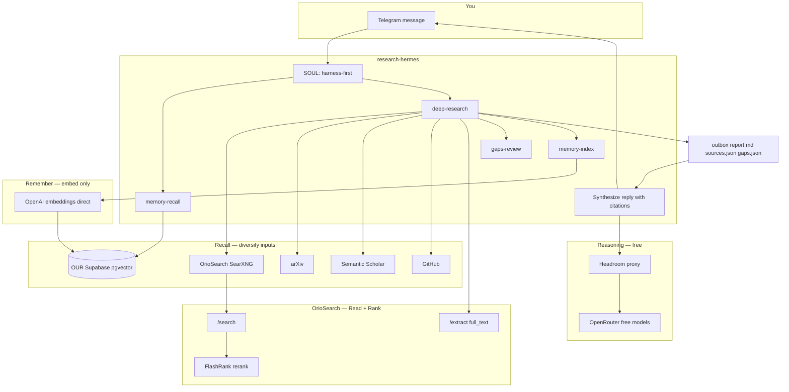

# Sovereign Research — how it works (and the Goodresearch vibe)

This doc ties together three things:

1. **The original VPS plan** ([VPS Sovereign Research Bot](5778d459-09d9-4e7c-bf95-8a3ae04c1626)) — Recall / Read / Rank / Remember on your own infra.
2. **What we actually shipped** — phases 1–4c, live on `148.230.110.43`.
3. **The Goodresearch article vibe** — trainable research habits (Vivek / “Researcher Rulebook”) — mapped to **code we run**, not philosophy we only tweet.

Public mirror: [github.com/DeEnabler/sovereign-research](https://github.com/DeEnabler/sovereign-research) — see `docs/Goodresearch.md` there too.

---

## Does it work end-to-end?

**Yes — for phases 1 through 4c.** Verified on VPS:

| Step | Command / artifact | Status |
|------|-------------------|--------|
| Local search | `web-search "query"` → OrioSearch `/search` | ✅ |
| Extract full text | OrioSearch `/extract` in `deep-research` | ✅ |
| Rerank | FlashRank in OrioSearch (`ms-marco-MiniLM-L-12-v2`) | ✅ |
| Multi-retriever recall | web + arXiv + Semantic Scholar + GitHub | ✅ |
| Write everything down | `/workspace/outbox/<slug>/` → `report.md`, `sources.json`, `queries.txt` | ✅ |
| Stare at outputs | `gaps-review` → `gaps.json` (extract failures, thin coverage) | ✅ |
| Remember | `memory-recall` → search → `memory-index` → OUR Supabase pgvector | ✅ |
| Vector similarity | OpenAI `text-embedding-3-small` direct (research-hermes only) | ✅ |
| Telegram agent | `research-hermes` + harness-first SOUL | ✅ |
| Chat stays free | Other 4 bots + research **reasoning** → OpenRouter free models via Headroom | ✅ |

**Not in v1 (original plan Phase 5):** X/Twitter API, RSS/news freshness harness, Exa replacement, OmniSearch, Harness-1, local GPU deep-research.

---

## Original plan — follow-through

The plan was: **fifth isolated agent**, sovereign OrioSearch sidecar, harness scripts (not 45-turn native web chains), compounding memory on **OUR** Supabase — makers unchanged.

| Plan item | Built? | Where |
|-----------|--------|-------|
| OrioSearch on VPS (Tavily-shaped, no SaaS) | ✅ | `/srv/agents/oriosearch/`, `scripts/oriosearch/` |
| `research-hermes` only (not clawdev/routebot/slava) | ✅ | `scripts/agent-config/research-hermes.yaml` |
| Native `web_search` / `web_extract` → local API | ✅ | `TAVILY_BASE_URL=http://orio-search-api:8000` |
| Harness-first (`web-search`, `deep-research`) | ✅ | `scripts/agent-bin/research/` |
| OUR vs CLIENT Supabase separation | ✅ | `Knowledge/Supabase-projects.md`, `.env` labels |
| pgvector Remember | ✅ | `scripts/research-memory/schema.sql`, `memory-*` |
| Rerank (owned Rank) | ✅ | `scripts/oriosearch/config.yaml` |
| Specialist retrievers | ✅ | `arxiv-search`, `scholar-search`, `github-search` |
| Gaps review before synthesis | ✅ | `gaps-review`, SOUL hard rule |
| Shared free OpenRouter budget preserved | ✅ | Harness = few LLM turns; chat uses `:free` models |
| Phase 5 freshness + X | ❌ Later | SOUL “Deferred” |

---

## Architecture: Recall → Read → Rank → Remember



**Privacy split:** Research *text* for memory embeddings goes to **OpenAI direct** (`OPENAI_API_KEY` on `research-hermes` only). Agent *reasoning* stays on **free OpenRouter** via Headroom. Other bots never see `OPENAI_API_KEY`.

---

## One deep-research run (the loop)

```
deep-research "topic"
  1. memory-recall "topic"          # Remember — prior chunks from OUR pgvector
  2. plan sub-queries               # Shannon-style: structured queries, not one vague ask
  3. recall from web + arxiv + scholar + github   # Diversify inputs
  4. OrioSearch search + rerank     # Rank
  5. extract top URLs → full_text   # Read the appendix, not the thread
  6. write outbox/
       report.md      — human-readable log (hypothesis → sources → gaps)
       sources.json   — machine-readable evidence
       queries.txt    — what we actually asked
  7. gaps-review      — stare at failures (extract errors, snippet-only rows)
  8. memory-index     — embed chunks → pgvector for next run
```

Agent rule (SOUL): **read `gaps.json` before replying** — don’t synthesize from reassurance; synthesize from evidence + known holes.

---

## Goodresearch vibes → what we coded

The article is about **trainable micro-skills**. We don’t automate taste or problem choice — we **operationalize** the habits that *can* be shell scripts and logs.

| Goodresearch principle | Article vibe | In this repo |
|------------------------|--------------|--------------|
| **Tighten the loop** | Research speed = how fast you discover you’re wrong; one command to launch, one to plot | `web-search`, `deep-research` — one command, full outbox artifact. No 20-turn native web chains. |
| **Write everything down** | Ideas lie until written; Darwin’s anti-self-deception log | Every run → `outbox/<timestamp>-<slug>/` with `report.md`, `sources.json`, `gaps.json`, `queries.txt`. Reread last month’s outbox = humility. |
| **Read the appendix, not the thread** | Primary source + limitations > viral summary | `extract` → `full_text` in `sources.json`; SOUL forbids snippet-only synthesis when full text exists. |
| **Stare at the outputs** | Karpathy: hours on raw data; Ng: read 100 failures | `gaps-review` lists extract failures, snippet-only sources, per-retriever coverage — **before** the model replies. |
| **Diversify inputs** | Shared reading lists → shared worthless conclusions | `deep-research` merges **web + arXiv + Scholar + GitHub**, not one SERP. |
| **Shannon method** | Shrink problem until trivial, solve, add complexity back | `quick` vs `deep` depth; `web-search` for atomic facts; `deep-research` only when needed. |
| **Engineering = research** | Frontier fuses builder + researcher | Harness scripts *are* the product — bash + Python, reproducible configs, deploy script. |
| **Never pay rent on intelligence** | Own Rank + Remember | FlashRank on your VPS; pgvector on **your** Supabase; Tavily SaaS replaced for search+extract. |
| **Pick your own problems** | Hamming lunch question; don’t absorb hype problems | **Human** — you choose the Telegram topic. Agent doesn’t scrape “trending”. |
| **Work backward (Schulman)** | Mode B: outcome you want → experiments | **Human** — you state the capability you need; harness gathers evidence backward from that goal. |
| **Train taste** | Predict before you run; score yourself later | **Human** — use `gaps.json` + `report.md` to calibrate what “good enough” means per topic. |
| **Study old material** | Bitter Lesson, Sutton, Shannon | **Partial** — arXiv/Scholar retrievers surface papers; no curated “classics” feed yet. |
| **Find your people** | Open door, generosity compounds | **Out of scope** — Telegram bot for you; public repo for others to fork. |

**Irrelevant to code (keep as human habits):** office-door sociology, career compounding pep talk, wandering across subfields for years — still true for *you*, not for a VPS script.

---

## Key paths (this monorepo)

| Path | Role |
|------|------|
| `scripts/oriosearch/` | Docker overlay, rerank config |
| `scripts/agent-bin/research/` | `web-search`, `deep-research`, retrievers, `gaps-review`, `memory-*`, `embed-key-status` |
| `scripts/research-memory/` | `schema.sql`, `embed_client.py` (OpenAI-first embeddings) |
| `scripts/agent-policy/research/SOUL.md` | Harness-first + Goodresearch operating principles |
| `scripts/agent-config/research-hermes.yaml` | Model, toolsets, `disabled_toolsets` (no `browser` — drops `web_search`) |
| `scripts/deploy-research.sh` | VPS deploy; `OPENAI_API_KEY` → research only |
| `Knowledge/Supabase-projects.md` | OUR vs CLIENT — memory never on client DB |
| `sovereign-research/` | Public git mirror of the above |

---

## Env (research memory)

| Variable | Purpose |
|----------|---------|
| `RESEARCH_SUPABASE_URL` | **OURS** project only |
| `OPENAI_API_KEY` | Embeddings on research-hermes only (preferred) |
| `OPENROUTER_API_KEY` | Free chat for all agents via Headroom |
| `TAVILY_BASE_URL` | `http://orio-search-api:8000` (local, not SaaS) |

Probe: `docker exec research-hermes embed-key-status`

---

## Verify E2E (smoke)

```bash
# On VPS
docker exec research-hermes embed-key-status
docker exec research-hermes web-search 'open source agent search 2026'
docker exec research-hermes deep-research 'pgvector RAG postgres' --depth quick
docker exec research-hermes memory-recall 'pgvector' --max 3
ls -lt /workspace/outbox | head -3
```

Expect: outbox dir with `report.md`, `sources.json`, `gaps.json`; memory recall with similarity scores (not `recall_mode: text`).

---

## Credits

- **Recall/Read/Rank/Remember** architecture — first-principles agent retrieval (our plan + reviewer synthesis, scope trimmed).
- [OrioSearch](https://github.com/vkfolio/orio-search) — Tavily-compatible sovereign API.
- **Goodresearch article** — operational discipline we encode in harness + outbox + gaps (popular “how to actually research” piece — see rulebook extract below).

---

## Appendix: Researcher Rulebook (article extract)

*The vibes we code vs the vibes we leave to humans — source text preserved for reference.*

<details>
<summary>Full article + rulebook extract (click to expand)</summary>

nobody really teaches you research. you get a desk, a problem someone else picked, and a vague instruction to produce something novel. so most people reverse-engineer the job from what they can see, which is papers, threads, and announcements, and what they end up learning is how to look like a researcher rather than how to be one. the actual skill is a stack of smaller skills, and almost every one of them can be deliberately trained.

**Core rules (extracted):**

1. **Pick your own problems** — Hamming: “What are the important problems, and why aren’t you working on them?”
2. **Work backward for originality (Schulman)** — Mode B: choose the outcome you want, then design experiments.
3. **Train taste** — predict before you run; correct after; repeat.
4. **Diversify inputs** — don’t share the same arXiv trending page as everyone else.
5. **Study old material** — fundamentals are underpriced.
6. **Shannon method** — shrink until trivial, solve, add complexity back.
7. **Breadth feeds depth** — pull models from neighboring fields.
8. **Read the appendix** — not the thread.
9. **Writing as fail-safe** — hypothesis → setup → expectation → result → updated belief.
10. **Tighten the loop** — one command runs, one command plots; reproducible configs.
11. **Stare at outputs** — failures teach more than a descending loss curve.
12. **Find your people** — generosity compounds (human network; not automated here).

</details>
